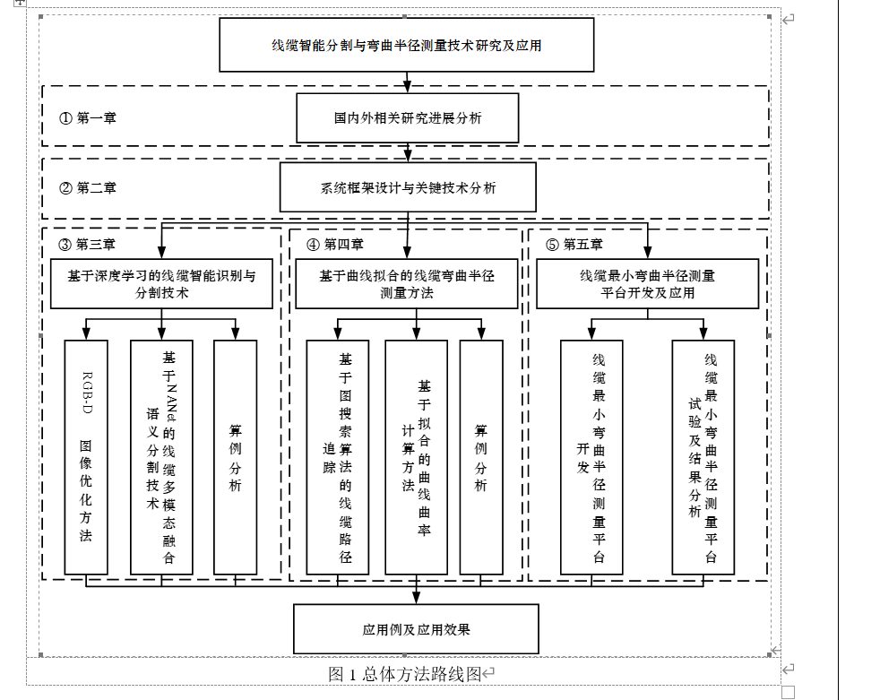

# 开题报告

Thesis Proposal

## 要求

1. 学生应通过调研和资料搜集(要有 10 篇以上相关文章的阅读量),主动与指导教师讨论,在指导教师指导下完成开题报告.开题报告需经各系或论文指导小组讨论、学院教学指导委员会审查合格后,方可正式进入下一步毕业设计(论文)阶段.
2. 理、工科开题报告撰写不少于 2500 字,人文社科开题报告不少于 3500 字.
3. 开题报告字体为小四号,宋体(英文需用 Times New Roman 字体),行距为固定值 20 磅.

## 参考

## 提纲

## issue

文献引用应该关于**国内外现状**

---

国内外现状的内容属实是少，找了一些专利阅读，支撑一些现在的方法

## reference

- [[1]齐咏生,陈培亮,高学金等.高精度实时语义分割算法框架:多通道深度加权聚合网络[J/OL].控制与决策:1-9[2023-02-27].https://doi.org/10.13195/j.kzyjc.2022.1699.](https://kns.cnki.net/kcms2/article/abstract?v=3uoqIhG8C45S0n9fL2suRadTyEVl2pW9UrhTDCdPD67Qai861I8G_TAeD2kUJtMcp0hIDz-kUqdrXxyiU7wvrfP35rqHQP1N&uniplatform=NZKPT&src=copy)

- [[2]方武震,姚旭成,赵永鹏等.浅析机载线缆弯曲半径的检测方法[J].电线电缆,2020(06):17-20.DOI:10.16105/j.cnki.dxdl.2020.06.005.](https://kns.cnki.net/kcms2/article/abstract?v=3uoqIhG8C44YLTlOAiTRKibYlV5Vjs7iy_Rpms2pqwbFRRUtoUImHae6S-T5nTIPVZiaD1CMzRQGrCvSgz-A4IVZQmB4vThs&uniplatform=NZKPT&src=copy)

  人工测量， 安全性问题

- [[3]陈波,张华,陈永灿等.基于特征增强的水工结构裂缝语义分割方法[J/OL].清华大学学报(自然科学版):1-9[2023-02-27].https://doi.org/10.16511/j.cnki.qhdxxb.2023.26.009.](https://kns.cnki.net/kcms2/article/abstract?v=3uoqIhG8C45S0n9fL2suRadTyEVl2pW9UrhTDCdPD67zQ2j_HAnx8cJfNh-KVSP85dH2jvJFHDkuBokuhM9q9wGmvJBS5jdM&uniplatform=NZKPT&src=copy)

- [[4] 一种电缆弯曲度测量方法](https://patents.google.com/patent/CN105180832A/zh)

  支撑光学测量

- [[5] 刘学林,王学海.电力电缆线路热伸缩危害及其对策](http://www.dlqyw.net/down/soft/%E6%8A%80%E6%9C%AF%E8%B5%84%E6%96%99/%E7%94%B5%E7%BC%86%E6%8A%80%E6%9C%AF/%E7%94%B5%E5%8A%9B%E7%94%B5%E7%BC%86%E7%BA%BF%E8%B7%AF%E7%83%AD%E4%BC%B8%E7%BC%A9%E5%8D%B1%E5%AE%B3%E5%8F%8A%E5%85%B6%E5%AF%B9%E7%AD%96.pdf)

- [6] 杨杰,黄朝兵.数字图像处理以及 MATLAB 实现[M].北京:电子工业出版社,2019:75-134

  数字图像处理
