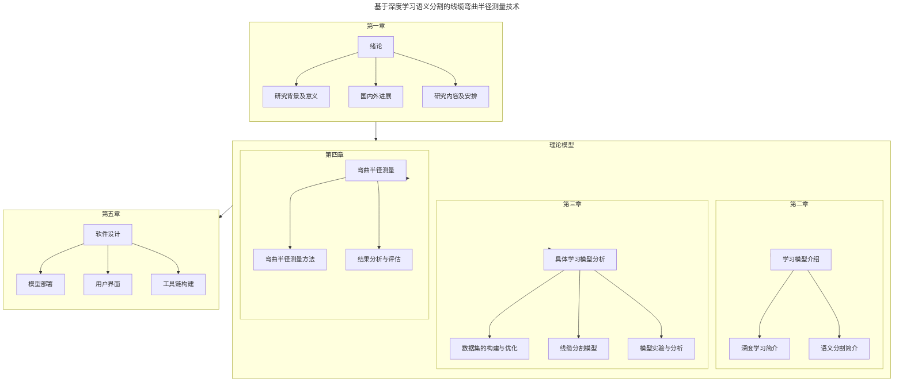

```mermaid
---
title: 基于深度学习语义分割的线缆弯曲半径测量技术
---
flowchart TD
  subgraph ch01 ["第一章"]
    direction TB
    ch01Title["绪论"]
    background["研究背景及意义"]
    situation["国内外进展"]
    content["研究内容及安排"]
    ch01Title --> background
    ch01Title --> situation
    ch01Title --> content
  end
  subgraph model ["理论模型"]
    direction TB
    subgraph ch02 ["第二章"]
      ch02Title["学习模型介绍"]
      introToDeepLearning["深度学习简介"]
      introToSemanticSegmentation["语义分割简介"]
      ch02Title --> introToDeepLearning
      ch02Title --> introToSemanticSegmentation
    end
    subgraph ch03 ["第三章"]
      ch03Title["具体学习模型分析"]
      data["数据集的构建与优化"]
      deepModel["线缆分割模型"]
      analysis["模型实验与分析"]
      ch03Title --> data
      ch03Title --> deepModel
      ch03Title --> analysis
    end
    subgraph ch04 ["第四章"]
      ch04Title["弯曲半径测量"]
      measure["弯曲半径测量方法"]
      critic["结果分析与评估"]
      ch04Title --> measure
      ch04Title --> critic
    end
  end
  ch01 --> model
  model --> ch02Title
  model --> ch03Title
  model --> ch04Title
  subgraph ch05 ["第五章"]
    direction TB
    ch05Title["软件设计"]
    deployment["模型部署"]
    UI["用户界面"]
    toolChain["工具链构建"]
  end
  model --> ch05
  ch05Title --> deployment
  ch05Title --> UI
  ch05Title --> toolChain
```
